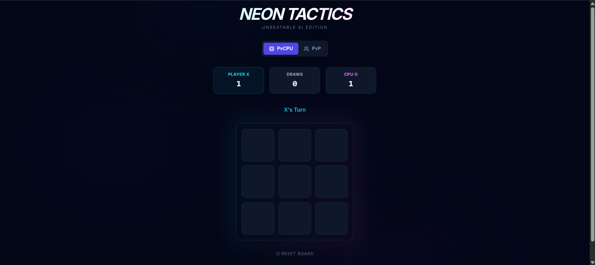

# Neon Tic-Tac-Toe



> **Note:** A sleek, glowing Tic-Tac-Toe game with local multiplayer and a smart AI opponent.

## 🚀 Overview

**Neon Tic-Tac-Toe** reinvents the classic pen-and-paper game with a modern dark aesthetics and neon glows. It features a "Smart Random" AI that actively tries to block your winning moves or win itself, making for an engaging single-player experience.

## ✨ Features

*   **🤖 Smart AI:** Challenges players by detecting winning lines and blocking threats.
*   **👥 Game Modes:** Switch seamlessly between Player vs CPU and Player vs Player (Local).
*   **🎨 Neon UI:** Dark mode interface with vibrant Cyan (X) and Pink (O) accents.
*   **🏆 Score Tracking:** Persistent scoreboard for the current session.
*   **✨ Animations:** Smooth pop-in effects and victory highlights.

## 🛠️ Tech Stack

*   **React 19** (Hooks: `useState`, `useEffect`, `useCallback`)
*   **TypeScript** (Strict typing for Game State)
*   **Tailwind CSS** (Styling, Gradients & Animations)
*   **Lucide React** (Icons)

## 🏃‍♂️ How to Run

1.  Clone the repository:
    ```bash
    git clone https://github.com/rathodyajvin-byte/neon-tictactoe.git
    ```
2.  Install dependencies:
    ```bash
    npm install
    ```
3.  Start the development server:
    ```bash
    npm start
    ```
